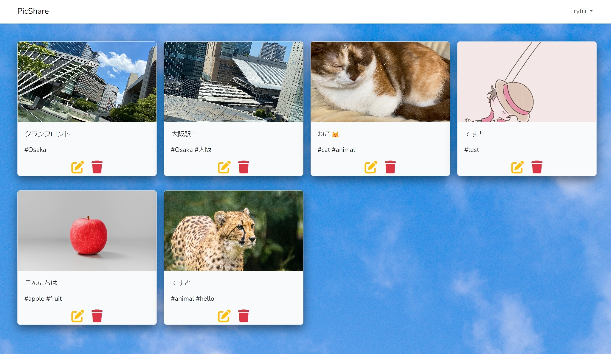

## PICSHARE

簡易インスタグラム。ログイン機能 / 文章・写真投稿 / タグ付け / タグ検索 / タグあいまい検索 / 投稿の更新・削除 等が使える。

AWSのlightsailを使用して、デプロイしている。

## 機能説明

**[ウェルカム画面](http://ryfiii.ddo.jp/)にアクセス後、Registerから登録する。**

**ホーム画面では、自分や他の人の投稿の閲覧ができるほか、文章・画像・タグをつけて新規投稿をすることもできる。**

**自分の名前→投稿履歴から自分の過去の投稿を編集、削除することができる。(sample@sample.com / sample123でログイン可能です)**

## ソースコード解説

- Controller -> App/Http/Controllers/HomeController.php メインコントローラー。できるだけ見やすいを意識

- Validate ->  App/Http/Reqests 投稿された値のバリデートを行うクラスをまとめている

- Models -> DBとのリレーション、DBとのやり取りを行うメソッドなどをまとめている

- View -> resources/views Bladeファイルをまとめている。CSS・JSはpublicの中にある

- Storage -> 投稿された写真をまとめている。publicとリンクしている
